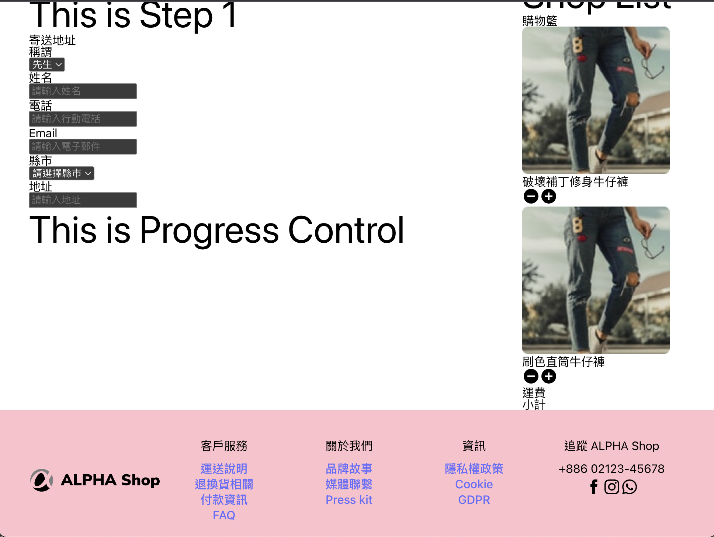
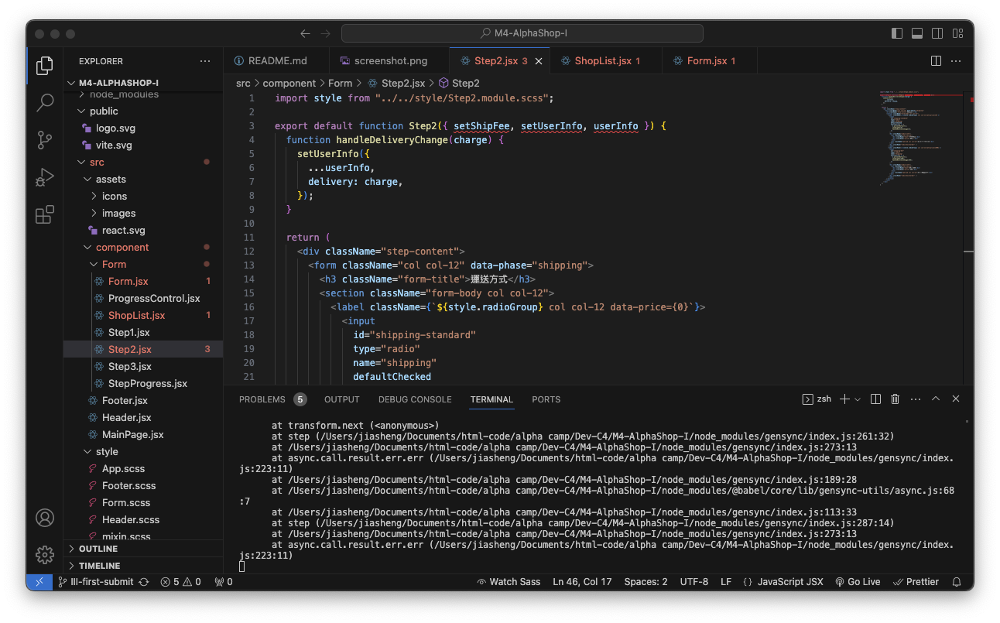
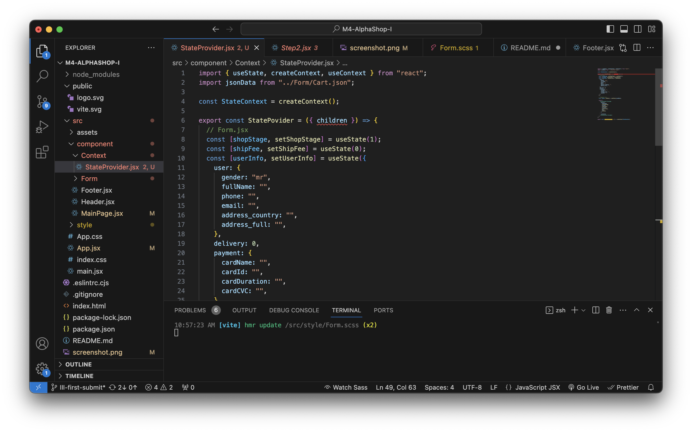

# Alpha Camp Dev-C4-M5 - Alpha Shop IIII

_This is frist submit of part IIII_

### The challenge

Users should be able to:

- RWD View in Website
- Show Shopping Cart in the view
- Submit UserInfo after clicked

## Update

- remove useState in component and use `StateProvider.jsx` to manage state.
- console.log `userInfo` after clicking submit.

### Screenshot



### Links

- Solution URL（branch：IIII-first-submit）: [https://github.com/Chious/M4-AlphaShop-I](https://github.com/Chious/M4-AlphaShop-I)
- Live Site URL: [Live Page](https://your-live-site-url.com)

#### How to fork the repo on local ?

** Important: This submit is on the branch of `II-first-submut`**

- Fork the repo
- Open Github Desktop > File > Clone Repo
- open document and type `npm i ` on terminal
- type `npm run dev` in terminal

## My Process

1. Create `StateContext`

```
StateContext = createContext();
```

2. `StateProvider` would return ContextProvider

```
    <StateContext.Provider value={{ state, setState,... }}>
      {children}
    </StateContext.Provider>
```

3. create `useStateContext`, so component could access to value of useContext

```
export const useStateContext = () => useContext(StateContext);
```

4. remove unnecessary useState.

## 已知 Bugs

1. `Step2`：`input[type=radius]`的 UI 顯示錯誤，已經卡了一個月了。

2. Form submit rule should be added to check if valid of form.

3. Try to send `userInfo` to backend in the future.

4. Why `Step2` show error while `userInfo` and `setUserInfo` is define and work in React ?
   

5. How to aviod VS code warning message while

```
function({props})
```

is valid in React ?



## Future Develop

- useContext to manage state
- update form data to back-end (by using Google App Script) after clicking button in `Step3`
- Limit rule of form input
- Adjust CSS setting

### Built with

- CSS custom properties
- Flexbox
- CSS Grid
- CSS Module
- SASS - to manage css component
- React Vite

### Useful resources

- [handle useState Event](https://react.dev/learn/updating-objects-in-state)

## Author

- Github - [邱佳昇](https://github.com/Chious)

## Acknowledgments

None
