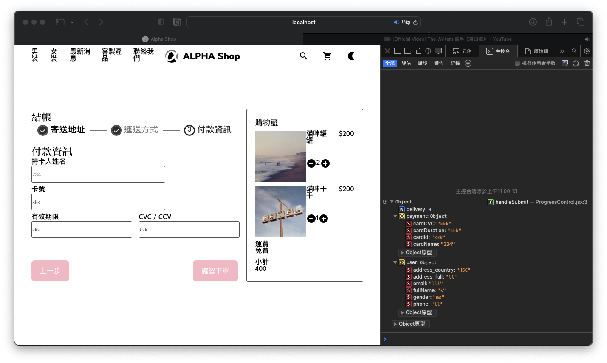

# Alpha Camp Dev-C4-M4 - Alpha Shop

### The challenge

Users should be able to:

- Fill the payment info in the form

### Screenshot



### Links

- Solution URL: [https://github.com/Chious/M4-AlphaShop-I](https://github.com/Chious/M4-AlphaShop-I)
- Live Site URL: [Live Page](https://your-live-site-url.com)

#### How to fork the repo on local ?

** Important: This submit is on the branch of `second-submut`**

- Fork the repo
- Open Github Desktop > File > Clone Repo
- open document and type `npm i ` on terminal
- type `npm run dev` in terminal

## Update

- Header

1. box-sizing: border-box

- Form

2. Apply css module to `Form`, so that we can set up grid respectly on `Step1`, `Step2` and `Step3`. And remove local setting from the global environment of `Form`
3. Adjust input color to `gray`

- all

4. Revise component without content to self closing tag

## Problem to slove

1. 原本要設定 select button 的樣式，不過不知道為什麼沒有用（`Form.scss`）

```css
select::after {
  z-index: 1;
  content: "\25bc";
  color: gray;
}
```

### Built with

- CSS custom properties
- Flexbox
- CSS Grid
- CSS Module
- SASS - to manage css component
- React Vite

### Useful resources

- [How to use Sass in React](https://www.youtube.com/watch?v=9F8bzIlgJ4g)
- [Apply CSS Module to SASS](https://blog.bitsrc.io/how-to-use-sass-and-css-modules-with-create-react-app-83fa8b805e5e)
- [Apply Multiple clasName in SASS](https://www.codeconcisely.com/posts/react-css-modules-multiple-classes/)
- [VS Code Extension - HTML to JSX](https://marketplace.visualstudio.com/items?itemName=riazxrazor.html-to-jsx) -- A useful tool to transfer html to JSX
- [Pass useState as props](https://blog.logrocket.com/noobs-guide-to-usestate/#:~:text=Passing%20useState%20as%20props%20in,in%20all%20of%20your%20components.&text=This%20is%20a%20bad%20practice,never%20use%20useState%20like%20this.)
- [CSS: border-box](https://developer.mozilla.org/en-US/docs/Web/CSS/box-sizing)

## Author

- Github - [邱佳昇](https://github.com/Chious)

## Acknowledgments None
