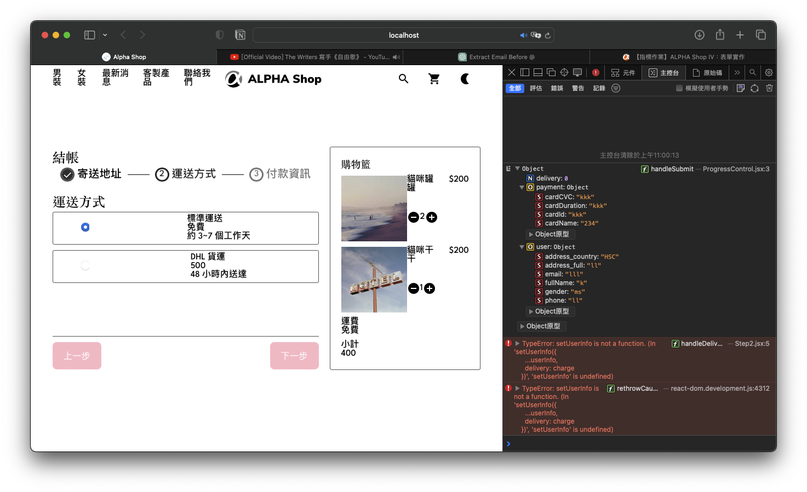

# Alpha Camp Dev-C4-M5 - Alpha Shop III

_This is frist submit of part III_

### The challenge

Users should be able to:

- RWD View in Website

## NEW!!

- Add or delete items in the cart
- Save User input in the form

### Screenshot


### Links

- Solution URL（branch：III-first-submit）: [https://github.com/Chious/M4-AlphaShop-I](https://github.com/Chious/M4-AlphaShop-I)
- Live Site URL: [Live Page](https://your-live-site-url.com)

#### How to fork the repo on local ?

** Important: This submit is on the branch of `II-first-submut`**

- Fork the repo
- Open Github Desktop > File > Clone Repo
- open document and type `npm i ` on terminal
- type `npm run dev` in terminal

## Update

1. `StepProgress`、`StepProgressControl`、`ShopList`、`Step`：Add useState individulally, and save the state in the `Form`

- data: content of the cart
- shipFee: payment of ship fee
- userInfo: content of the submit form

## 已知 Bug

1. `Step2`

- 不知道為什麼 Delivery 沒辦法更新 State 的值
- Button UI 無法正確顯示，不知道為什麼

2. 關於 `handleUserInfoChange`目前是一個一個 function 寫，我有考慮過改寫成這樣，不過沒有成功。

```js
function handleUserChange(e, UserInfoTarget){
    e.preventDefault();

    setUserInfo({
        ...userInfo, user{...userInfo.user,UserInfoTarget: e.target.value}
    })
}


// <input>

onClick={setUserInfo(e, "userName")}

```

3. VS Code 的顯示 Bug，當使用 React props 的命名時會跳出紅字



4. 第一次被版本控制搞到了，新增分支的時候慎選！

## Future Develop

- useContext to manage state
- update form data to back-end (by using Google App Script) after clicking button in `Step3`
- Limit rule of form input
- Adjust CSS setting

### Built with

- CSS custom properties
- Flexbox
- CSS Grid
- CSS Module
- SASS - to manage css component
- React Vite

### Useful resources

- [handle useState Event](https://react.dev/learn/updating-objects-in-state)

## Author

- Github - [邱佳昇](https://github.com/Chious)

## Acknowledgments None
